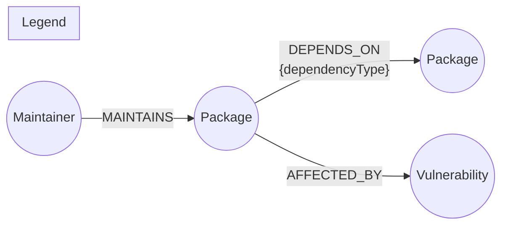

# DepGraph — Open-Source Dependency Risk Explorer

A small web app that traces **transitive risk** through a software package's
dependency tree — vulnerability exposure, copyleft license leakage, and
maintainer "bus factor" — backed by [CognoDB](https://console.cognodb.com),
a managed graph database.

> Built for the Wexa AI take-home assignment. Use case, data model, and code
> are original to this submission.

---

## 1. The use case

Every modern application is really a *tree of other people's code*. `express`
pulls in a dozen packages, each of which pulls in more, and by the time you're
five levels deep you're trusting code from people you've never heard of,
under licenses you haven't read, with security histories you haven't checked.

DepGraph lets a non-technical person (an engineering manager, a security
reviewer, a compliance lead) type a package name and immediately see:

- **The full transitive dependency tree**, traced multiple hops deep.
- **Every known vulnerability reachable anywhere in that tree**, not just in
  the package's direct dependencies.
- **Copyleft license exposure** — a GPL/AGPL dependency five hops down can
  create an obligation nobody on the team is aware of.
- **Maintainer bus-factor risk** — packages you depend on that are all
  quietly maintained by the same one or two people.

### Why a graph database?

The questions above are all *reachability and path* questions, and that is
precisely where a relational schema starts to strain and a graph database
starts to shine:

| Question | Relational (Postgres/MySQL) | Graph (CognoDB / openCypher) |
|---|---|---|
| "What does `X` depend on, transitively?" | Recursive CTE, manually bounded to avoid infinite loops on cycles, re-written per depth | `(:Package)-[:DEPENDS_ON*1..5]->(:Package)` — one line |
| "What CVEs live anywhere in that tree?" | Recursive CTE **joined** to a vulnerability table at every level, with de-duplication logic for diamond dependencies (the same vulnerable package reachable via two different paths) | Same traversal pattern, joined by simply extending the path one more hop to `Vulnerability` |
| "Which maintainers does this package share with others?" | Self-join through a junction table, awkward to express as "packages this package's maintainers *also* maintain" | A 2-hop `Package-Maintainer-Package` pattern — this *is* what graphs are for |
| "Shortest path from A to B through the dependency graph?" | Not expressible without a recursive CTE plus manual shortest-path bookkeeping | `shortestPath()` is a built-in primitive |

None of this is impossible in SQL — but it requires recursive CTEs, careful
cycle-guarding, and multiple joins per query, and it gets slower and uglier
as the tree gets deeper. In a graph, traversal depth is a *parameter*, not a
schema redesign. That's the argument this project is built to demonstrate.

---

## 2. Data model



**Nodes**

| Label | Key properties |
|---|---|
| `Package` | `name` *(unique)*, `version`, `license`, `description`, `demoOnly` |
| `Maintainer` | `npmUsername` *(unique)*, `name` |
| `Vulnerability` | `cveId` *(unique)*, `severity`, `description`, `fixedIn` |

**Relationships**

| Type | Direction | Properties | Meaning |
|---|---|---|---|
| `DEPENDS_ON` | `Package → Package` | `dependencyType` (`runtime` / `dev` / `peer` / `optional`) | A pulls in B |
| `MAINTAINS` | `Maintainer → Package` | — | Person publishes/owns the package |
| `AFFECTED_BY` | `Package → Vulnerability` | — | Package has a known CVE at its seeded version |

The full node/relationship types, with example data, are also in
[`docs/data-model-diagram.md`](docs/data-model-diagram.md).

---

## 3. Seed data

`scripts/generate-data.js` builds a realistic dependency graph modeled on the
real npm ecosystem (~78 packages, ~70 `DEPENDS_ON` edges, 23 maintainers, 15
vulnerabilities) and writes it to `scripts/data/graph-data.json`.

**Two things in the dataset are intentionally synthetic, and clearly marked:**

- Two fictional packages (`acme-copyleft-utils`, `gpl-crypto-toolkit`,
  `demoOnly: true`) exist purely to give the license-conflict query something
  to find, without falsely attributing a copyleft license to a real project.
- **Every** vulnerability record uses a `DEMO-CVE-` prefix and is fictional —
  none of them are real, published CVEs. They exist to give the transitive
  vulnerability-exposure query real data to traverse. This is called out
  again in the UI itself, next to the vulnerability table.

Real package names, versions, and licenses are otherwise accurate as of the
dataset's creation.

`scripts/seed.js` loads that JSON into your CognoDB instance with
parameterized, `UNWIND`-batched, `MERGE`-based Cypher — safe to re-run.

---

## 4. Setup — from zero to running app

### 4.1 Create your CognoDB instance

1. Go to **[console.cognodb.com/signup](https://console.cognodb.com/signup)** and create a free account (no credit card required).
2. From the console, create a **free (c0) instance** and pick a region. It provisions in under a minute.
3. Copy the connection URI (`bolt+s://<instance-id>.databases.cognodb.cloud`) and the generated password for the `cognodb` user — **the password is shown exactly once**, so save it now.

### 4.2 Configure the app

```bash
cd depgraph-risk-explorer
cp .env.example .env
```

Edit `.env`:

```env
COGNODB_URI=bolt+s://<your-instance-id>.databases.cognodb.cloud
COGNODB_USER=cognodb
COGNODB_PASSWORD=<the password from the console>
PORT=3000
```

### 4.3 Install, seed, run

```bash
npm install
npm run seed     # generates + loads the dataset into your CognoDB instance
npm start        # http://localhost:3000
```

You should see:

```
DepGraph — starting up…
✅ Connected to CognoDB.
DepGraph listening on http://localhost:3000
```

If the database is unreachable, the server still starts, but the UI shows a
clear "can't reach CognoDB" state instead of crashing — try `express` in the
search box once it's up to see the app in action.

### 4.4 Deploy a hosted demo (required deliverable)

Any Node-friendly free host works — e.g. **Render**, **Railway**, or **Fly.io**:

1. Push this repo to GitHub.
2. Create a new Web Service from the repo on your host of choice.
3. Build command: `npm install`. Start command: `npm start`.
4. Set the three `COGNODB_*` environment variables (and `PORT` if your host
   requires a specific one) in the host's dashboard — **never commit `.env`**.
5. Once deployed, run `npm run seed` once (locally, pointed at the same
   CognoDB instance, or via your host's one-off job runner) to populate data.

---

## 5. The main queries, explained

All queries live in one place: [`server/queries/cypher.js`](server/queries/cypher.js).
Every one is parameterized — nothing is string-concatenated into Cypher.

- **`DEPENDENCY_TREE`** — the multi-hop traversal requirement.
  `(:Package)-[:DEPENDS_ON*1..5]->(:Package)`, returning every node reachable
  within 5 hops along with the full chain. Powers the schematic diagram on
  the "Dependency Tree" tab.

- **`TRANSITIVE_VULNERABILITIES`** — the "awkward in a relational database"
  requirement. Walks the same variable-length path, then extends one more
  hop to `Vulnerability`, and uses `shortestPath()` to report the minimum
  depth at which each CVE enters — trivial here, a multi-join recursive CTE
  in SQL.

- **`SHARED_MAINTAINER_RISK`** / **`MAINTAINER_SUMMARY`** — 2-hop
  `Package-Maintainer-Package` patterns surfacing bus-factor risk.

- **`LICENSE_CONFLICTS`** — same variable-length traversal, filtered to a
  known copyleft-license set, returning the exact dependency chain that
  introduces the conflict.

- **`SHORTEST_PATH_BETWEEN`** — `shortestPath()` between any two packages,
  powering the "Path Finder" tab.

---

## 6. Project structure

```
depgraph-risk-explorer/
├── server/
│   ├── index.js           # Express entry point, startup connectivity check
│   ├── db.js               # neo4j-driver wrapper, session handling, errors
│   ├── routes/api.js       # HTTP routes → Cypher queries
│   └── queries/cypher.js   # every Cypher query, parameterized
├── scripts/
│   ├── generate-data.js    # builds the seed dataset (JSON)
│   ├── seed.js              # loads it into CognoDB (idempotent, parameterized)
│   └── data/graph-data.json
├── public/
│   ├── index.html
│   ├── styles.css
│   └── app.js               # vanilla JS SPA, no build step
├── docs/
│   └── data-model-diagram.md
├── .env.example
└── README.md (this file)
```

---

## 7. Engineering notes

- **Secrets**: connection URI/password are read from environment variables
  only (`server/db.js`), never hard-coded, and `.env` is git-ignored.
- **Error handling**: `server/db.js` verifies connectivity at boot and logs
  a clear diagnostic instead of crashing; every API route (`server/routes/api.js`)
  wraps its handler and returns a structured `503` with a human-readable
  message on DB failure, which the frontend renders as an explicit
  "can't reach CognoDB" screen rather than a blank page or console error.
- **No string-concatenated Cypher** anywhere — every query takes parameters
  via the driver's native parameter binding.

---

## 8. Screenshots

_Add screenshots of the running app here before submitting — landing page,
a traced dependency schematic, the vulnerability tab, and the maintainer-risk
tab are the most representative four._

## 9. Demo

- **Hosted demo:** _add your deployed URL here_
- **Screen recording:** _add your recording link here_
