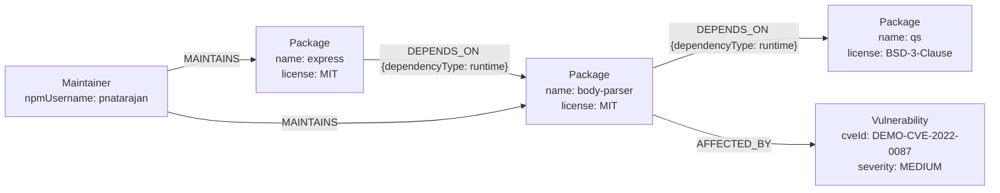

# Data model

## Diagram

## Node labels

### `Package`
| Property | Type | Notes |
|---|---|---|
| `name` | string | Unique. Primary lookup key everywhere in the app. |
| `version` | string | Seeded version, npm-style semver. |
| `license` | string | SPDX-style identifier (`MIT`, `Apache-2.0`, `GPL-3.0`, …). |
| `description` | string | One-line summary. |
| `demoOnly` | boolean | `true` for the two fictional packages used to demonstrate license-conflict detection. |

### `Maintainer`
| Property | Type | Notes |
|---|---|---|
| `npmUsername` | string | Unique. |
| `name` | string | Display name. |

### `Vulnerability`
| Property | Type | Notes |
|---|---|---|
| `cveId` | string | Unique. All seeded records use a `DEMO-CVE-` prefix and are synthetic. |
| `severity` | string | `CRITICAL` / `HIGH` / `MEDIUM` / `LOW`. |
| `description` | string | One-line summary. |
| `fixedIn` | string | Version the fix ships in. |

## Relationship types

### `(:Package)-[:DEPENDS_ON {dependencyType}]->(:Package)`
Directed from the dependent package to its dependency. `dependencyType` is
one of `runtime`, `dev`, `peer`, `optional` — mirrors how npm itself
categorizes dependencies, and is available to filter on if you extend the
queries.

### `(:Maintainer)-[:MAINTAINS]->(:Package)`
No properties. A maintainer can maintain many packages; a package can have
several maintainers — this many-to-many shape is what makes the
shared-maintainer / bus-factor query a natural 2-hop traversal instead of a
junction-table self-join.

### `(:Package)-[:AFFECTED_BY]->(:Vulnerability)`
No properties (severity and fix version live on the `Vulnerability` node
itself, since a CVE's severity doesn't vary by which package references it).

## Why this shape, specifically

- **`DEPENDS_ON` is directed and typed** so the dependency tree can be walked
  in one direction (root → leaves) while still knowing *why* an edge exists
  (a `peer` dependency behaves very differently from a `runtime` one in real
  supply-chain risk analysis).
- **`Vulnerability` is its own node, not a property bag on `Package`**,
  because a single CVE can affect multiple packages/versions, and modeling
  it as a node lets `AFFECTED_BY` be queried and counted independently of
  which package the traversal started from.
- **`Maintainer` is separate from `Package`** specifically to make the
  bus-factor pattern a graph-native 2-hop traversal rather than something
  bolted on via a junction table — this is the clearest example in the
  project of a relationship the graph model surfaces "for free."
